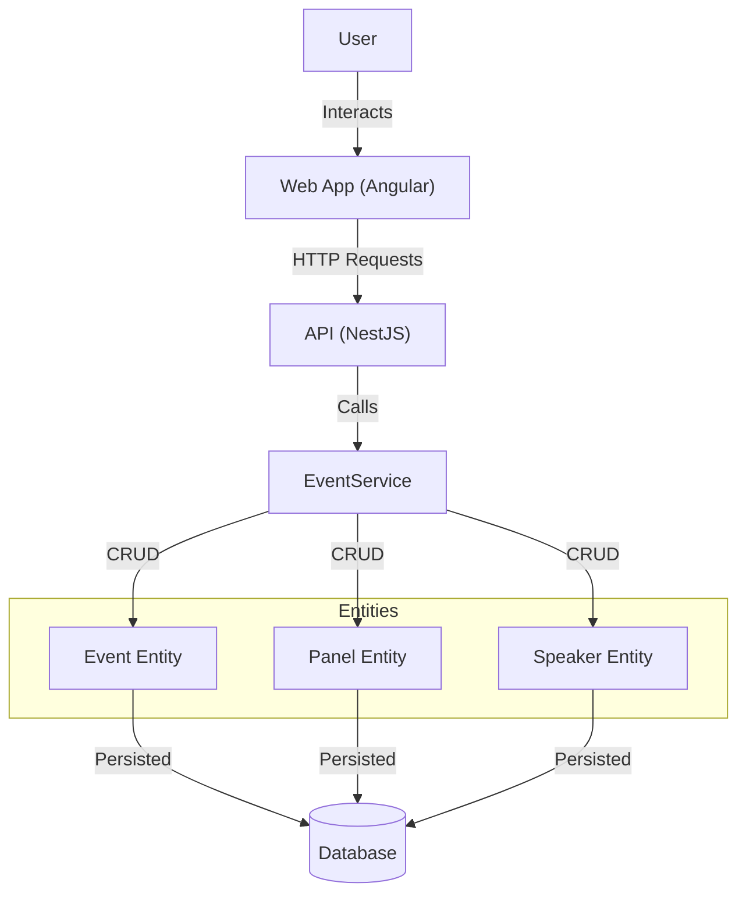

```mermaid
flowchart TD
    User["User"]
    WebApp["Web App (Angular)"]
    API["API (NestJS)"]
    EventService["EventService"]
    Event["Event Entity"]
    Panel["Panel Entity"]
    Speaker["Speaker Entity"]
    DB[(Database)]

    User -->|Interacts| WebApp
    WebApp -->|HTTP Requests| API
    API -->|Calls| EventService
    EventService -->|CRUD| Event
    EventService -->|CRUD| Panel
    EventService -->|CRUD| Speaker
    Event & Panel & Speaker -->|Persisted| DB

    subgraph Entities
        Event
        Panel
        Speaker
    end
```
